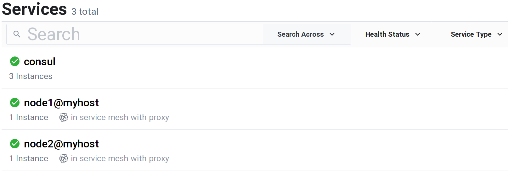
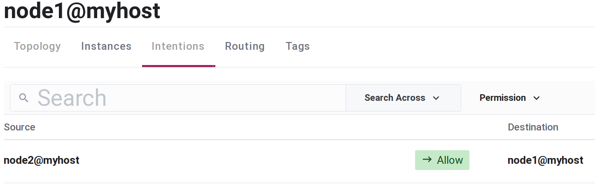

# MeshxNode

<!-- MDOC !-->
Service mesh distribution module.

`MeshxNode` implements custom carrier protocol for the Erlang [distribution as module](https://erlang.org/doc/apps/erts/alt_dist.html#distribution-module), designed to work with service mesh adapter implementing `Meshx.ServiceMesh` behavior.

Standard Erlang distribution depends on two components: Erlang Port Mapper Daemon ([EPMD](https://erlang.org/doc/man/epmd.html)) and distribution module which by default is [:inet_tcp_dist](https://github.com/erlang/otp/blob/master/lib/kernel/src/inet_tcp_dist.erl). Traffic generated by both components is unencrypted. Distribution module :inet_tcp_dist can be replaced with [`:inet_tls_dist`](http://erlang.org/doc/apps/ssl/ssl_distribution.html) offering TLS. There is no out-of-the-box solution to secure EPMD.

`MeshxNode` can be considered as alternative to EPMD and :inet_tcp_dist.
`MeshxNode` by using service mesh provides following benefits:
  * automatic traffic encryption with service mesh data plane mTLS,
  * "node services" registration and management with external service mesh application control plane.

`MeshxNode` distribution module cannot be started during Beam VM boot process, `iex` command line arguments `--name` and `--sname` are not supported.

## Requirements
`MeshxNode` depends on service mesh adapter. `Meshx` is released with `MeshxConsul` service mesh adapter, required adapter configuration steps are described in package [documentation](https://github.com/andrzej-mag/meshx_consul).

## Installation
Add `:meshx_consul` and `:meshx_node` to application dependencies:
```elixir
# mix.exs
def deps do
  [
    {:meshx_consul, "~> 0.1.0-dev", github: "andrzej-mag/meshx_consul"},
    {:meshx_node, "~> 0.1.0-dev", github: "andrzej-mag/meshx_node"}
  ]
end
```

## Usage
Start non-distributed node using `MeshxNode` as distribution module:
```shell
iex -pa _build/dev/lib/meshx_node/ebin --erl "-proto_dist Elixir.MeshxNode" -S mix
```
Used command arguments:
  * `-pa` - adds specified directory to the code path (`dev` environment path is used here),
  * `-proto_dist` - specifies custom distribution module (physical file name is: `Elixir.MeshxNode_dist.beam`).

Transform node into distributed using `Node.start/3`:
```elixir
iex(1)> Node.start(:node1@myhost)
{:ok, #PID<0.248.0>}
iex(node1@myhost)2>
# [node1@myhost][stdout]: ==> Consul Connect proxy starting...
# [node1@myhost][stdout]:     Configuration mode: Agent API
# [node1@myhost][stdout]:         Sidecar for ID: node1@myhost
# [node1@myhost][stdout]:     Proxy ID: node1@myhost-sidecar-proxy
# [node1@myhost][stdout]: ==> Log data will now stream in as it occurs:
iex(node1@myhost)3> Node.self()
:node1@myhost
```
`Node.start/3` command starts "node service" using `MeshxConsul.start/4`. Lines marked with `#` are stdout output of command running sidecar proxy binary, by default Consul Connect proxy.

Using second terminal, start another node:
```elixir
iex(1)> Node.start(:node2@myhost)
{:ok, #PID<0.258.0>}
```

Consul UI screenshot showing both "node services" registered:


Use Consul UI to allow/deny connection between nodes with [Consul intentions](https://www.consul.io/docs/connect/intentions):


`MeshxNode` is fully compatible with standard Erlang distribution. After connecting both nodes with `Node.connect/1`, one can for example spawn new process on remote node using `Node.spawn/4`. When connecting to other node `MeshxConsul.connect/3` function is executed.

Other `erl` command line options that might be helpful:
  - `-start_epmd false` - do not start EPMD,
  - `-kernel inet_dist_use_interface {127,0,0,1}` - limit Erlang listen interface to loopback,
  - `-connect_all false` - do not maintain a fully connected network of distributed Erlang nodes,
  - `-no_epmd` - specifies that the distributed node does not need epmd at all (OTP24+).

<!-- MDOC !-->
Next section on hexdocs.pm: [Configuration options].
